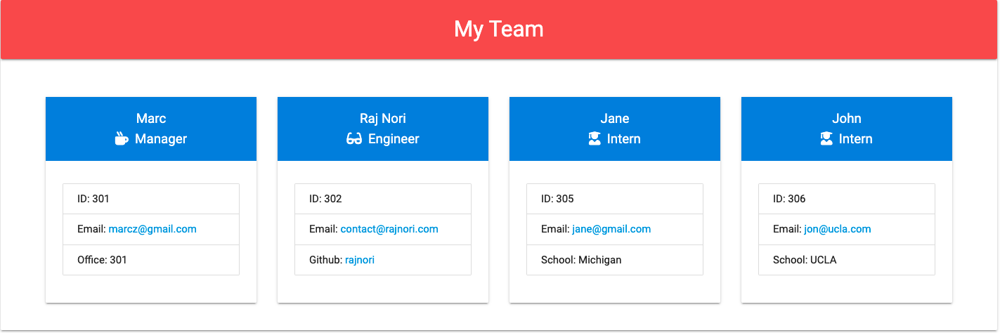

Team Members Generator
===
By Raj Nori. Generate a web-page of your development team members.
Usage
===
Run ```node index.js``` and answer question prompts.

# Project Name

> Team Profile Generator

## Table of Contents
* [General Info](#general-information)
* [Technologies Used](#technologies-used)
* [Features](#features)
* [Screenshots](#screenshots)
* [Video](#Video-walkthrough)
* [Setup](#setup)
* [Usage](#usage)
* [Project Status](#project-status)
* [Room for Improvement](#room-for-improvement)
* [Acknowledgements](#acknowledgements)
* [Contact](#contact)
<!-- * [License](#license) -->


## General Information
- This is a node.js project with Tesd driven development as the primary focus. 
- It takes user input from the Command line regarding the users team and generates a html page which displays the team profile information.
- The prupose of te project is to generate a team member information page from basic command line input that.
- It is in interesteg project that develops my ability to write unit tests in Jest and further my ability to use Node.js and npm libraries including inquirer.

## Technologies Used
- Node.js - version 17.9.0
- JEST - 26.6.3
- inquirer(pacakge) - 7.3.3
- JavaScript - ES6
- Css - version 3.0
- Html - version 5


## Features
List the ready features here:
- Takes input from the command line
- Generates a Company profile


## Screenshots

<!-- If you have screenshots you'd like to share, include them here. -->

## Video

## Setup
The project uses the inquirer package and JEST as part of the installation, please install them before running the program.


## Usage
You can use `npm start` as a command as the command has been pre configured in the package.json file.


## Project Status
Project is: _complete

## Room for Improvement

Room for improvement:
- Edge cases need to be tested for and added as features.

To do:
- Different messages for different use cases.


## Acknowledgements
Give credit here.
- This project was inspired by...Monash Bootcamp
- This project was based on the assignment team generator.
- Many thanks to....https://www.pluralsight.com/courses/test-driven-development-big-picture & other TDD resoureces online including Test Driven Development by Kent Beck.


## Contact
Created by [@rajnori](https://rajnori.github.io/Portfolio-project/) - feel free to contact me!


